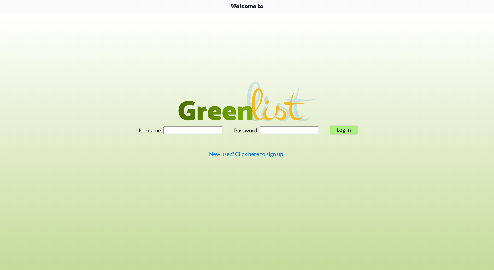

# Greenlist Registry (back end) (full-stack app)

**WINNER** of Pursuit 6.2 Hackathon's **Most Impactful Award**!



Designers, especially independent and small designers, lack a centralized resource to find, research, and even discover eco-friendly sustainable materials they can use.

Greenlist Registry aims to be an official registry, directory, and forum for designers and brands to find providers and suppliers of green materials. As well as serve as a networking vessel for material reclaim.

We see Greenlist as an app that can be implemented sooner rather than later into the fashion ecosystem and it would fill a large gap in the workflow of independent designers and small businesses.

---

### _Table of Contents_

- [Technologies Implemented](#i-technologies-implemented)
- [Setup](#ii-setup)
- [Developer's To Dos](#iii-to-do)
- [Presentation Slides](#iv-presentation-slides)
- [Database Schema](#v-database-schema)
- [Endpoints](#vi-endpoints)
- [Wireframes](#vii-wireframes)

### _Repos_

- [Back End](https://github.com/joseph-p-pasaoa/greenlistRegistry_back__Web) (this repo)
- [Front End](https://github.com/joseph-p-pasaoa/greenlistRegistry_front__Web)

## **Developers**

- [**Aransa Garcia**](https://github.com/aransagarcia) (Program Manager)
- [**Joseph P. Pasaoa**](https://github.com/joseph-p-pasaoa) (Tech Lead)
- [**Kathy Puma**](https://github.com/KathyPuma) (PR Review)
- [**Sergio Salama**](https://github.com/sergiocohens) (UX/UI)

## Instructional Team

- **LEAD Instructor:** [Alejandro Franco](https://github.com/alejo4373)
- **IA:** [Jung Rae Jang](https://github.com/jungraejang)
- **IA:** [Wynter Reid](https://github.com/wynterreid)
- **Program Manager:** [Dessa Shepherd](https://www.linkedin.com/in/dessa-shepherd-7a55b374/)
- **Mentor:** [Robert Abreu](http://www.fiveeightyeight.com/)
- **Uber Tech Advisor:** [Prateek Arora](https://www.linkedin.com/in/arora-prateek/)

## Industry Advisors

- Percy Hicks -- [EclecticLifestyleByPercyHicks (Instagram)](https://www.instagram.com/eclecticlifestylesbypercyhicks)
- Isabella Montoya Paz -- [PazLifestyle](https://www.pazlifestyle.com/)
- Van Tran -- [Van Tran | Sport Elle Inc](https://www.linkedin.com/in/van-tran-ny/)
- Lisa Vastola -- [Lisa Vastola | Republic Clothing Group](https://www.linkedin.com/in/lisa-vastola-8371431b/)

## Developers' Notes

## **I. Technologies Implemented**

+ PostgreSQL 12.1
+ Express.js 4.16.1
+ React 16.12.0
+ React/Redux 7.2.0
+ Redux 4.0.5
+ React Router Web 5.1.2
+ Pg-promise 10.4.4
+ Axios 0.19.2
+ Bootstrap 4.4.1
+ React Bootstrap Carousel 4.0.3
+ Multer 1.4.2
+ Node.js 13.8.0
+ JavaScript 2019 / ECMAScript 10
+ HTML5
+ CSS3
+ Git / Github

## **II. Setup**

+ To run this project [back end], install it locally using npm:
  ```
  $ npm install
  $ npm start
  ```
+ Instantiate and seed the PostgresQL database:
  ```
  $ cd database
  $ psql -f greenlist_registry_db.sql
  ```
+ To run the full stack application of Greenlist, install the [front end](https://github.com/joseph-p-pasaoa/greenlistRegistry_front__Web) locally, as well, in a separate folder using npm:
  ```
  $ npm install
  $ npm start
  ```
+ GREENLIST can then be found in browser at: http://localhost:12000/

## **III. Developers' To Dos**

+ Materials Research Dashboard
+ Styling Consistency
+ Mobile Device Responsiveness
+ Further Bootstrap Integration
+ Encrypted User-Auth

### **IV. PRESENTATION Slides**

[Presentation PDF](./readme/Greenlist-Pursuit_Hackathon_Presentation.pdf)

### **V. Database SCHEMA**


  - **Creators**
    - id
    - username - _Unique, Not Null_
    - firstname - _Not Null_
    - lastname - _Not Null_
    - password - _Not Null_
    - about
    - avatar_url
    - phone_number
    - email - _Unique, Not Null_
    - website_url
    - address

  - **Resourcers**
    - id
    - company - _Unique, Not Null_
    - password - _Not Null_
    - about
    - avatar_url
    - phone_number
    - email - _Unique, Not Null_
    - website_url
    - address

  - **Materials**
    - id
    - name - _Not Null_
    - description - _Not Null_
    - photo_url

  - **Products**
    - id
    - name - _Not Null_
    - body - _Not Null_
    - resourcers_id - _References Resourcers + On Delete Cascade_
    - material_id - _References Materials_

  - **Reclaims**
    - id
    - name - _Not Null_
    - quantity_num - _Not Null_
    - quantity_label - _Not Null_
    - time_created
    - body - _Not Null_
    - composition - _Not Null_
    - creator_id - _References Creators + On Delete Cascade_
    - is_need - _Boolean_

  - **Photos**
    - id
    - photo_url - _Not Null_
    - reclaim_id - _References Reclaims + On Delete Cascade_

---

### **VI. ENDPOINTS**

- **Creators**

  | Method | Endpoint        | Description              | Body Data                                                                                                         |
  | ------ | --------------- | ------------------------ | ----------------------------------------------------------------------------------------------------------------- |
  | GET    | `/creators`     | Get all creators         | n/a                                                                                                               |
  | GET    | `/creators/:id` | Get single creator by id | n/a                                                                                                               |
  | POST   | `/creators/add`    | Add new creator          | `username`, `firstname`, `lastname`, `password`, `avatar_url`, `phone_number`, `address`, `email`, `website_url`, `about` |
  | PATCH | `/creators/edit`    | Update creator Info      | `username`, `firstname`, `lastname`, `password`, `avatar_url`, `phone_number`, `address`, `email`, `website_url`, `about`  |

* **Resourcers** 

  | Method | Endpoint         | Description                | Body Data                                                                                    |
  | ------ | ---------------- | -------------------------- | -------------------------------------------------------------------------------------------- |
  | GET    | `/resourcers`     | Get all resourcers          | n/a                                                                                          |
  | GET    | `/resourcers/:id` | Get single resourcer by id | n/a                                                                                          |
  | POST   | `/resourcers/add`    | Add new resourcers          | `company_name`, `avatar_url`, `about`, `password`, `phone_number`, `address`, `email`, `website_url` |
  | PATCH | `/resourcers/edit`    | Update creator Info        | `username`, `avatar_url`, `about`, `phone_number`, `address`, `email`, `website_url`, `about`       |

- **Products**

  | Method | Endpoint                   | Description                  | BodyData                                      |
  | ------ | -------------------------- | ---------------------------- | --------------------------------------------- |
  | GET    | `/products`                | Get all products             | n/a                                           |
  | GET    | `/products/:resourcer_id` | Get product by resourcer ID | n/a                                           |
  | POST   | `/products/add`                | ADD new Product              | `name`, `body`, `resourcer_id`, `material_id` |
  | DELETE | `/products/delete/:id`            | Delete single product by ID  | n/a                                           |

- **Reclaims**

  | Method | Endpoint                   | Description                  | BodyData                                                         |
  | ------ | -------------------------- | ---------------------------- | ---------------------------------------------------------------- |
  | GET    | `/reclaims`                | Get all reclaims             | n/a                                                              |
  | GET    | `/reclaims/:resourcer_id` | Add new reclaim              | n/a                                                              |
  | POST   | `/reclaims/add`                | ADD new reclaim              | `name`, `body`, `composition`,  `quantity_num`, `quantity_label`, `time_created`, `creator_id`, `is_need` |
  | DELETE | `/reclaims/delete/:id`            | Delete reclaim product by ID | n/a                                                              |

* **Materials**

  | Method | Endpoint         | Description       | Body Data |
  | ------ | ---------------- | ----------------- | --------- |
  | GET    | `/materials`     | Get all materials | n/a       |
  | GET    | `/materials/:id` | get all by ID     | n/a       |

* **Photos**
​
  | Method | Endpoint              | Description           | Body Data |
  | ------ | --------------------- | --------------------- | --------- |
  | GET    | `/photos`             | Get all photos        | n/a       |
  | GET    | `/photos/:reclaim_id` | Get all by reclaim_id | n/a       |
  | POST   | `/photos/add/`        | Add new photo         | `photo_url`, `reclaim_id` |
  | DELETE | `/photos/delete/:id`         | Delete photo          | n/a       |

---

### **VII. WIREFRAMES**

[Wireframes PDF](./readme/wireframes.pdf)
